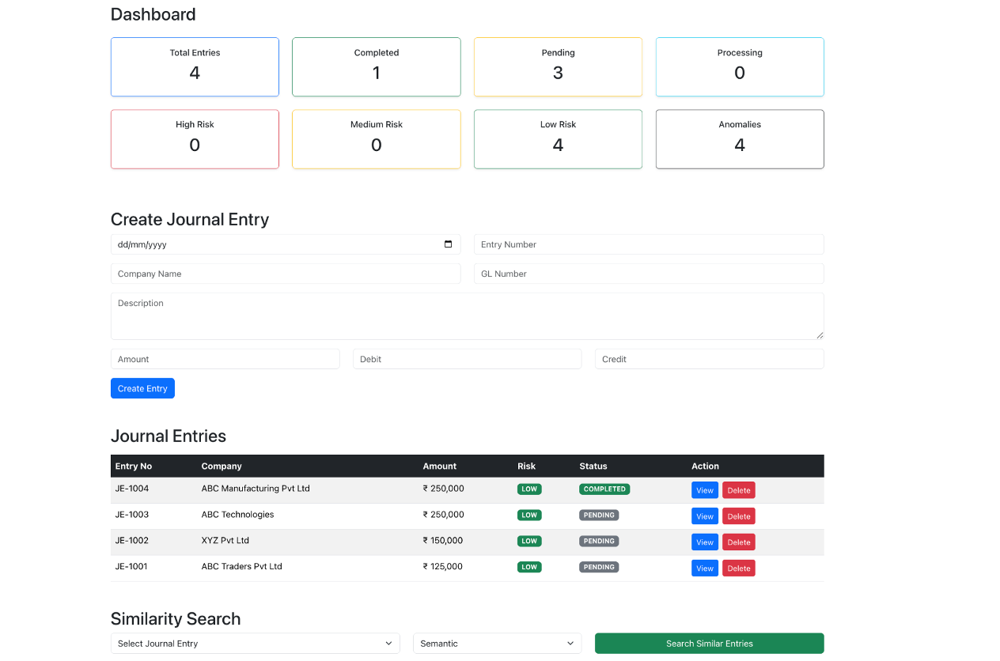
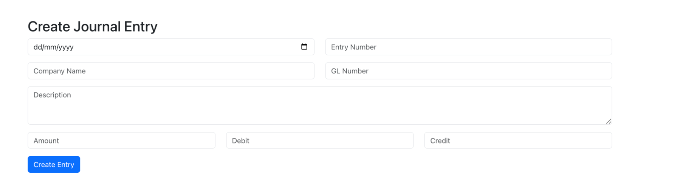
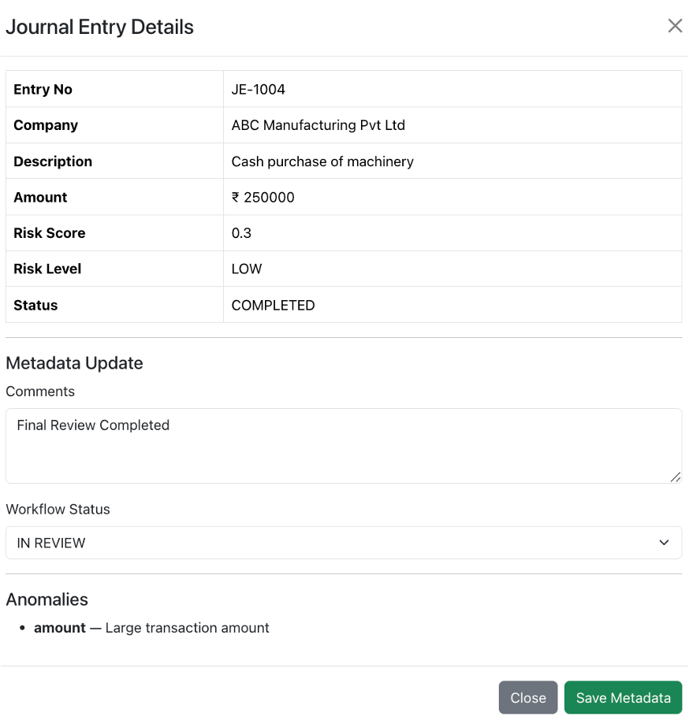
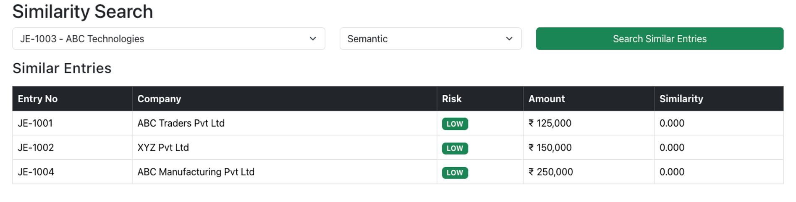

# 🚀 Smart Audit Pipeline

<p align="center">


</p>

An **AI-powered Financial Audit Pipeline** built using the **MERN Stack**. The application simulates an intelligent auditing workflow by asynchronously enriching journal entries with AI-generated **risk scoring**, **anomaly detection**, **metadata management**, and **vector similarity search**.

---

# 📖 Project Overview

Financial organizations process thousands of journal entries every day. Manual auditing is time-consuming, expensive, and prone to human error.

This project demonstrates how an **event-driven AI enrichment pipeline** can analyze journal entries asynchronously without affecting transactional performance.

Each journal entry is automatically enriched with:

- ✅ Risk Score
- ✅ Risk Level
- ✅ Anomaly Detection
- ✅ Semantic Vector
- ✅ Financial Vector
- ✅ Entity Vector

The system also provides:

- Dashboard Analytics
- Journal Entry Management
- Metadata Updates
- Similarity Search
- Background AI Processing
- Complete CRUD Operations

---

# ✨ Features

## Backend

- RESTful CRUD APIs
- ES6 Class-based Architecture
- Repository-Service-Controller Pattern
- MongoDB with Mongoose
- Background AI Enrichment Worker
- Automatic Risk Score Calculation
- Risk Level Classification
- AI-based Anomaly Detection
- Semantic Vector Generation
- Financial Vector Generation
- Entity Vector Generation
- Dashboard Statistics API
- Similarity Search API
- Metadata Update API
- Database Migration Script
- Risk Score Update Script

---

## Frontend

- Dashboard Overview
- Journal Entry Management
- Entry Details Modal
- Metadata Update
- Delete Journal Entry
- Similarity Search
- Responsive Bootstrap Interface
- React Class Components

---

# 🛠 Technology Stack

### Frontend

- React (Class Components)
- JavaScript (ES6)
- Axios
- Bootstrap 5

### Backend

- Node.js
- Express.js
- MongoDB
- Mongoose

---

# 🏗 System Architecture

```text
                  React Frontend
                         │
                         ▼
                 Express REST API
                         │
                         ▼
                  Controller Layer
                         │
                         ▼
                    Service Layer
                         │
                         ▼
                  Repository Layer
                         │
                         ▼
                      MongoDB
                         │
                         ▼
              Background AI Worker
                         │
                         ▼
                AI Enrichment Engine
                         │
      ┌────────────┬──────────────┬──────────────┐
      ▼            ▼              ▼
 Risk Score   Anomaly Detection   Vector Generation
```

---

# 🔄 Application Workflow

```text
Create Journal Entry
        │
        ▼
 Store in MongoDB
        │
        ▼
 Background AI Worker
        │
        ▼
 Risk Score Calculation
        │
        ▼
 Anomaly Detection
        │
        ▼
 Vector Generation
        │
        ▼
 Dashboard Analytics
        │
        ▼
 Similarity Search
        │
        ▼
 Metadata Review
```

---

# 📸 Application Screenshots

## Dashboard Overview

The dashboard provides a complete overview of the audit pipeline, including journal entry statistics, processing status, AI-generated risk distribution, anomaly count, journal management, and similarity search.



---

## Journal Entry Management

The Journal Entries section displays all financial transactions with company information, transaction amount, AI-generated risk level, processing status, and available actions.



---

## Journal Entry Details & Metadata

View complete journal information, AI-generated risk score, detected anomalies, workflow status, and auditor comments. Metadata can be updated directly from this interface.



---

## AI Similarity Search

Search similar journal entries using Semantic, Financial, and Entity similarity strategies to identify related financial transactions.



---

# 📂 Project Structure

```text
MERN_1
│
├── backend
│   ├── config
│   ├── controllers
│   ├── models
│   ├── repositories
│   ├── routes
│   ├── scripts
│   ├── services
│   ├── workers
│   ├── package.json
│   └── index.js
│
├── frontend
│   ├── public
│   ├── src
│   │   ├── components
│   │   ├── services
│   │   ├── App.js
│   │   └── index.js
│   └── package.json
│
├── screenshots
│   ├── dashboard.png
│   ├── journal-table.png
│   ├── entry-details.png
│   └── similarity-search.png
│
├── README.md
└── .gitignore
```

---

# ⚙ Installation

## Clone the Repository

```bash
git clone https://github.com/jyoti260995/MERN_1.git
cd MERN_1
```

---

## Backend Setup

```bash
cd backend
npm install
```

Create a `.env` file

```env
PORT=2000
MONGO_URI=mongodb://127.0.0.1:27017/audit-pipeline
```

Run the backend

```bash
npm run dev
```

---

## Frontend Setup

```bash
cd frontend
npm install
npm start
```

Frontend:

```
http://localhost:3000
```

Backend:

```
http://localhost:2000
```

---

# 📜 Available Scripts

## Backend

| Command | Description |
|----------|-------------|
| `npm run dev` | Start development server |
| `npm run seed` | Populate sample journal entries |
| `npm run migrate:models` | Upgrade existing journal entries |
| `npm run update:risk` | Recalculate risk scores |

---

## Frontend

| Command | Description |
|----------|-------------|
| `npm start` | Start React application |
| `npm run build` | Create production build |

---

# 📡 REST API Endpoints

| Method | Endpoint | Description |
|---------|----------|-------------|
| POST | `/api/entries` | Create Journal Entry |
| GET | `/api/entries` | Get All Journal Entries |
| GET | `/api/entries/:id` | Get Journal Entry |
| PUT | `/api/entries/:id` | Update Journal Entry |
| DELETE | `/api/entries/:id` | Delete Journal Entry |
| PUT | `/api/entries/:id/metadata` | Update Metadata |
| GET | `/api/entries/dashboard/stats` | Dashboard Statistics |
| POST | `/api/entries/search/similar` | Similarity Search |

---

# 🤖 AI Enrichment Pipeline

Every journal entry is automatically processed by the background worker to generate:

- Risk Score
- Risk Level
- Anomaly Detection
- Semantic Vector
- Financial Vector
- Entity Vector

This asynchronous architecture keeps journal entry creation responsive while AI processing executes independently.

---

# 🚀 Future Improvements

- JWT Authentication
- Role-Based Access Control
- Pagination
- Advanced Filtering
- Export Reports (Excel/PDF)
- AI Embedding Models
- Docker Support
- CI/CD Pipeline
- Email Notifications

---

# 👩‍💻 Author

**Jyoti Rani**

GitHub: **https://github.com/jyoti260995**

---

# 📄 SmartAudit Engineering Assessment

This project was developed as part of the **SmartAudit Engineering Assessment**. It demonstrates an event-driven MERN application that combines asynchronous AI enrichment, anomaly detection, risk analysis, metadata management, and vector similarity search for intelligent financial auditing.
